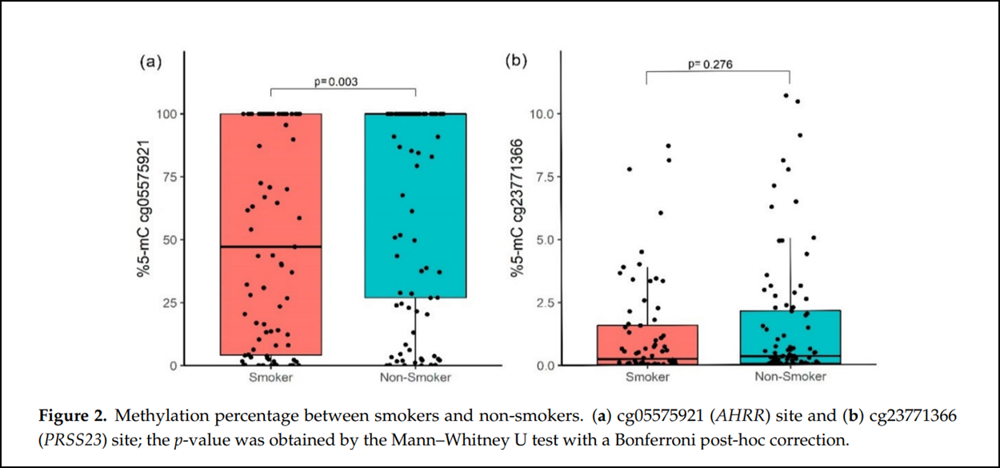

# Week 3 - Working with data files 

```{r, echo=FALSE, message=FALSE, warning=FALSE, error=FALSE}
library(webexercises) # for solution button. Details needed in the yaml for the buttons to work
```

## Introduction

The aim of this chapter is to reproduce the following figure from [Bravo-Gutierrez et al (2021)](https://doi.org/10.3390/genes12081276). The figure shows the percentage of methylation for two genes, AHRR (fig. 2a) and PRSS23 (fig. 2b), as compared across smokers and non-smokers. The genetics aspect might be confusing (at least to us psychologists) but the statistics are very basics (a Mann-Whitney U test). The authors found a significant difference across smokers AHRR gene (p=0.003) but not across the PRSS23 gene (p=0.276) 

```{r, echo=FALSE, out.width='100%', fig.align='center'}

```

The authors of the paper have made the data from the study open access (as all good scientists should!), but not their code. Let's replicate the analysis and see if we can find the same results and can create the same image.  

Download the data from the papers supplemental materials at the bottom of [the paper](https://doi.org/10.3390/genes12081276) or if you have access to moodle I have uploaded the file to this weeks section.   

For this chapter your will need the following packages. If needed, check previous chapters for how to install and load packages. 

```{r,  message=FALSE, warning=FALSE}
library(tidyverse) # tidy grammer and ggplot for the graphs
library(broom) # tidys up and statistical findings
library(ggpubr) # to add p values to graph
```


## Reading data into R from a data file

Data is often messy, this is especially true of data you don't collect yourself, and it's *especially especially* true for data that other academics share online. Data transparency is often an afterthought for a publication, with little care and attention given to if the data is usable, and mostly just shared in order to tick the box to say that its available. 

Thankfully, the data shared for this paper is nice and neat and tidy, we only need to take a few steps to get it into R. 

### Setting your working directory

Each time you start an analysis in R I recommend that you create a new folder. Put all the data you want to analyses in that folder. Open a script in R and save that script in your newly created folder along with your data.  

```{r, echo=FALSE, out.width='50%', fig.align='center'}
knitr::include_graphics("Images/Data in working directory.png")
```

Once everything is in the same place, back in RStudio, set your **working directory** by clicking **Session** `->` **Set Working Directory** `->` **Choose Directory** and then select your chosen folder.

This allows R to know where to look when you want to import data, and also where to save any outputs. It seems like a silly step when we're just making a couple of plots, but as your projects become more complicated this kind of workflow becomes invaluable. 

### File formats and reading in the data

Open the Excel file downloaded from the supplemental materials of Bravo-Gutierrez et al 2021. You should see four tabs at the bottom of the file, this means we're going to have to split this file up into individual pages to get it into RStudio. Excel files also comes with a whole load of hidden junk that that we don't want so instead we would like to save this tab out as a Comma-Separated Values (CSV) file, which is just a text file with a comma separating of the values in our data set.   

Our data is on tab S4 and luckily it's in a lovely state and just requires us to *navigate to the S4 tab*, click *save as* and then *select CSV from the drop down "save as type" menu*. Save this to the folder you created previously.

`r hide("The nightmare excel file")`
Before continuing, take a quick look at the other tabs in the file. Tab one looks intimidating but this is just two screen shots from an online gene database. It's tabs S2 and S3 that scare me (or at least it would take me a while to get them into a usable form). If you scroll down on either of these tabs you'll see that the headers repeat themselves and the data is not all neatly in a line as you would find in an SPSS file. Carry on further with R and you'll learn how to work with this, and other even messier, kind of data, and turn it into whats known as [tidy data](https://cran.r-project.org/web/packages/tidyr/vignettes/tidy-data.html).
`r unhide()`

### Reading data in to R

So long as you have set your working directory and your have loaded the `tidyverse` package the following code, adapted for your file name, will read the data in and assign it to an object. 

```{r, echo=FALSE, message=FALSE, warning=FALSE}
raw_data <- read_csv("https://raw.githubusercontent.com/RichClarkePsy/Datasets/main/genes-1338748-supplementary%20figure%202.csv")
```

```{r, eval=FALSE}
raw_data <- read_csv("Bravo-Gutierrez figure 2 data.csv")
```

`r hide("Why use read_csv rather than read.csv")`

While the `read.csv` is from base R, the `read_csv` function is found in the `readr` package from the `tidyverse` so there's and extra step to get the function but its worth it for three reasons:

1. `read_csv` does not convert character strings into factors by default, unlike read.csv.
2. `read_csv` returns tibbles rather than data frames. Basically, the same but tibbles work better with the other `tidyverse` packages 
3. `read_csv` something to do with NAs.

Is this the dullest note topic in the whole book? Maybe, its a good contender at least. 

`r unhide()`

### Self test

What does the working directory do? `r mcq (c(answer = "It is the location on your computer where RStudio runs and accesses your files", "It give you extra RAM to your analysis quicker", "It changes the colour theme of RStudio"))`  

What is a CSV file? `r mcq(c("A file specially made for use in R", answer = "A general use text file storing tabular data, separated by commas", "A file for storing supplementary figure for a paper"))`

What would you type to read the following data and assign it to a object `data`?

Can you read an SPSS file into R? `r mcq(c("That program is dead to us now. Never speak those letter again!", answer = "Yes, check out the Haven package for more on this topic"))`


## Step 2: Data wrangling

We are yet to wrangle. Well, I wrangled a little in the last chapter but didn't really explain


We only actually need three variables from this dataset so the first thing we are going to do to tidy this data set up is to pull out those variables and put them in a new object called `fig2_data`.

Use the `select` function (as mentioned in week 1) to take the variables `Sample_ID`, `%5mc-AHRR` & `%5mc-PRSS23` and create a new object called `fig2_data` 

```{r, message=FALSE, warning=FALSE} 
fig2_data <- raw_data %>%
  select(Sample_ID, `%5mc-AHRR`,`%5mc-PRSS23`)
```

If you look at the `Sample_ID` variable, you'll see that the variable indicates if the participant is a non-smoker (NS) or smoker (S) and it includes their ID number. In order to recreate the analysis we need to create a new variable that just contains the smoker or non-smoker data.  

There are a number of ways to do this, but here is what I did: 

```{r,  message=FALSE, warning=FALSE}
fig2_data <- fig2_data %>%
  mutate(smoker = case_when(str_starts(Sample_ID, "NS") ~ "Non-Smoker",
                            str_starts(Sample_ID, "S") ~ "Smoker")) 
```

The first line tells R to just overwrite the same data object with whatever we do next. I then used the `mutate` function to create a new variable. This variable will be called `smoker` and I've told R to look at the start of each string of data in the variable `Sample_ID` and if the letters "NS" are first then put "Non-Smoker" in the new variable, and if the letter "S" if first then put "Smoker" in the new variable.

If you were to `View(fig2_data)` now you will see a new variables has been created with our smoker/non-smoker information. 

Lets also change the names on our gene variables while we're at it:

```{r, message=FALSE, warning=FALSE}
fig2_data <- fig2_data %>%
  rename(AHRR = `%5mc-AHRR`,
         PRSS23 = `%5mc-PRSS23`)
```

`r hide("Note about variable names")`
Variable names need to be in a specific format for R to recognise them as such. Our original data starts with a % sign which confuses R. To get around this issue it encloses the name in `` punctuation, as a way to indicate that this is a string. More commonly you'll see this when your variable name have a SPACE between words. It's worth recording these when you see them as they can be a bit of a pain when it comes to using auto-complete in your analysis later on. 
`r unhide()`

## Step 3: Discriptive statistics and basic visulisation

Now we'll run some basic summary statistics to get a feel of the data.

Create a new dataframe called `fig2_discriptives` out of the `fig2_data` object. This dataframe needs to contain the number of partcipants and the mean, median, and standard deviation of AHRR methylation split by smokers and non-smokers.

For this you will need to use the `group_by` and `summarise` functions as mentioned in week 2. There is also some missing data so you will also need to include the following code at various points `na.rm = TRUE`

`r hide("Click for solution")`
```{r,  message=FALSE, warning=FALSE}
fig2_discriptives <- fig2_data %>%
  group_by(smoker) %>%
  summarise(N = n(), 
            Mean = mean(AHRR, na.rm = TRUE), 
            Median = median(AHRR, na.rm = TRUE), 
            SD = sd(AHRR, na.rm = TRUE))

```
`r unhide()`

Next use `ggplot` to create a basic box plot of the `AHRR` methylation variable as separated by our `smoker` independent variable.  

`r hide("Click for solution")`
```{r,  message=FALSE, warning=FALSE}
fig2_data %>%
  ggplot(aes(x=smoker, y=AHRR)) +
  geom_boxplot()
```
`r unhide()`

## Step 4: Statistical test 

Now for the statistical test

```{r,  message=FALSE, warning=FALSE}
test_result <- wilcox.test(AHRR ~ smoker, data=fig2_data) %>%
  tidy() %>%
  mutate(p.value = round(p.value, digits = 3))
```

 cg05575921
```{r,  message=FALSE, warning=FALSE}
my_comparisons <- list(c("Smoker", "Non-Smoker"))

fig2_data %>%
  ggplot(aes(x=smoker, y=AHRR, fill=smoker)) +
  geom_boxplot() +
  scale_fill_brewer(palette="Dark2") +
  stat_compare_means(comparisons = my_comparisons) +
  geom_jitter(width = .25) + 
  scale_y_continuous(name = "%5mc-cg05575921") +
  theme(legend.position = "none")
```

## Test yourself exercise

Create a new script and create the following for the PRSS23 gene

* A dataframe containing the summary statistics
* A dataframe containing the comparison analysis
* Figure 2b from the original paper.


Note to create Figure 2b you will need this additional line of code that will re-scale the y-axis:
`scale_y_continuous(limits=c(0, 10), name = "PRSS23")`


```{r,  message=FALSE, warning=FALSE}
# reveal for answer
fig2_discriptives <- fig2_data %>%
  group_by(smoker) %>%
  summarise(N = n(), 
            Mean = mean(PRSS23, na.rm = TRUE), 
            Median = median(PRSS23, na.rm = TRUE), 
            SD = sd(PRSS23, na.rm = TRUE))


fig2_data %>%
  ggplot(aes(x=smoker, y=PRSS23, fill=smoker)) +
  geom_boxplot() +
  scale_fill_brewer(palette="Dark2") +
  stat_compare_means(comparisons = my_comparisons, label.y = 10) +
  geom_jitter(width = .25) + 
  scale_y_continuous(limits=c(0, 10), name = "PRSS23") + # limits added to make it look like the paper 
  theme(legend.position = "none")

# more work needed to add the p values

```

